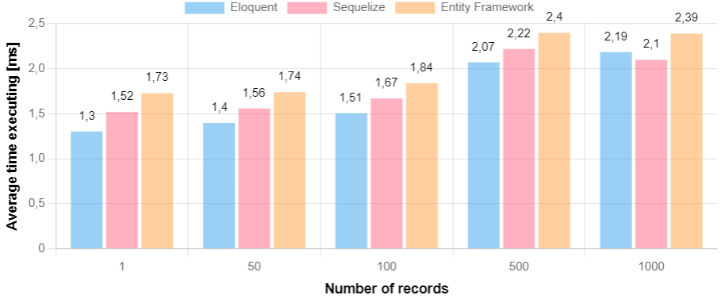

<h1 align="center">
ORM Benchmarking
</h1>

A fully automotive advanced ORM benchmark. Easily expandable with new ORM's.

# Features
* Test ORM in CRUD performance 
* Fully parametrized (number of records, number of repeats, data size)
* Easy to expand with new ORM's, languages and benchmark cases
* Provides simple report page that shows results on interactive charts
* Automatically generates database and fills it with random data
* Easy to run - just run one bash file

# Tested ORMs
* C# (.NET):
  * Entity Framework Core v8.0.4
  * raw SQL
* PHP:
  * Eloquent (illuminate/database) v11.1.1
  * raw SQL (PDO)
* JavaScript:
  * Sequelize v6.37.2
  * raw SQL

# Methodology
The goal of the benchmark is research the executing speed of several CRUD operations. The benchmark cases allow performance testing for simple as well as complex queries. The process of creating database, data and benchmarking is fully automatized.

The research hypothesis:

<cite>ORM tools in different programming languages differ in both functionality and performance. ORM tools in compiled languages (such as Java or C#) tending to achieve better performance in database operations than ORM tools in interpreted languages (such as PHP or JavaScript), at the cost of greater configuration complexity and less flexibility.</cite>

1. Create database structure (migration)
2. Generate random data (users and courses) and fill database with this data
3. Run benchmark for each ORM
   * Make database backup
   * Run each test scenario sequentially 100 times
   * If we're modifying records in database (INSERT, UPDATE, DELETE) after iteration restore database from backup and perform next iteration
   * After performed scenario calculate average time and standard deviation of results
   * After performed all scenarios, send results to endpoint ``/save-results`` to save the results
   * Repeat 3. step for each ORM and no-ORM tests
4. You can view benchmark results in report.html file

# Database
We are simulating an LMS (Learning Management System). There are simplified database based on [Learnin](https://github.com/krzysztofhewelt/learnin), my LMS implementation.
The database consists of 10k users (9500 students and 500 teachers), 500 courses and over 3000 tasks. Data is randomly generated.


Each ORM have the same entities:
* ```User```
  * which has one ```Student``` (additional information about student)
  * which has one ```Teacher``` (additional information about teacher)
  * which has many ```Courses```
* ```Student```
  * which belongs to one ```User```
* ```Teacher```
  * which belongs to one ```User```
* ```Course```
  * which has many ```Users```
  * which has many ```Tasks```
* ```Task```
  * which belongs to one ```Course```

# Benchmark cases
1. **Select queries:**
   * Q1. Select n first users
   * Q2. Select n students and their courses order by surname
   * Q3. For n students select tasks to do (with course information)
2. **Insert queries:**
   * Q4. Insert n users with additional information (student or teacher) using transaction
   * Q5. Insert n courses
3. **Update queries:**
   * Q6. For n courses prolong available to date
4. **Delete queries:**
   * Q7. For n users take them out of courses
   * Q8. Delete n courses

# Results
For more information open ``report.html``.

Benchmark parameters:
* Number of repeats: 100
* Number of records tested: 1, 50, 100, 500, 1000

## Select queries
### Q1. Select n first users


<table style="width: 100%;">
    <thead>
        <tr>
            <th rowspan="2">
                Language/ORM
            </th>
            <th colspan="5">
                &Delta; difference between ORM and non-ORM [ms]
            </th>
        </tr>
        <tr>
            <th>1</th>
            <th>50</th>
            <th>100</th>
            <th>500</th>
            <th>1000</th>    
        </tr>
    </thead>
    <tbody>
        <tr>
            <td>PHP/Eloquent</td>    
            <td>-0.29</td>    
            <td>-0.13</td>    
            <td>-0.22</td>    
            <td>-0.94</td>    
            <td>-1.80</td>    
        </tr>
        <tr>
            <td>JS/Sequelize</td>    
            <td>-0.17</td>    
            <td>-0.12</td>    
            <td>-0.17</td>    
            <td>-1.34</td>    
            <td>-2.37</td>    
        </tr>
        <tr>
            <td>C#/Entity Framework</td>    
            <td>-0.66</td>    
            <td>-1.48</td>    
            <td>-1.76</td>    
            <td>-3.34</td>    
            <td>-3.92</td>    
        </tr>
    </tbody>
</table>

<details>
<summary><b>Generated queries (1000 records):</b></summary>

Without ORM (1 query):
```sql 
SELECT * FROM users LIMIT 1000
```

Eloquent (1 query):
```sql
select * from `users` limit 1000
```

Sequelize (1 query):
```sql
SELECT `id`, `name`, `surname`, `email`, `password`, `account_role`, `active` FROM `users` AS `User` LIMIT 1000;
```

Entity Framework (1 query):
```sql
SELECT `u`.`id`, `u`.`account_role`, `u`.`active`, `u`.`email`, `u`.`name`, `u`.`password`, `u`.`surname` FROM `users` AS `u` LIMIT 1000
```
</details>


### Q2. Select n students and their courses order by surname


<table style="width: 100%;">
    <thead>
        <tr>
            <th rowspan="2">
                Language/ORM
            </th>
            <th colspan="5">
                &Delta; difference between ORM and non-ORM [ms]
            </th>
        </tr>
        <tr>
            <th>1</th>
            <th>50</th>
            <th>100</th>
            <th>500</th>
            <th>1000</th>    
        </tr>
    </thead>
    <tbody>
        <tr>
            <td>PHP/Eloquent</td>    
            <td>-1.35</td>    
            <td>-2.70</td>    
            <td>-3.95</td>    
            <td>-14.00</td>    
            <td>-5.22</td>    
        </tr>
        <tr>
            <td>JS/Sequelize</td>    
            <td>-0.64</td>    
            <td>-1.09</td>    
            <td>-1.57</td>    
            <td>-8.76</td>    
            <td>-13.75</td>    
        </tr>
        <tr>
            <td>C#/Entity Framework</td>    
            <td>0.00</td>    
            <td>+0.09</td>    
            <td>+0.27</td>    
            <td>+1.95</td>    
            <td>+37.27</td>    
        </tr>
    </tbody>
</table>

<details>
<summary><b>Generated queries (1000 records):</b></summary>

Without ORM (1 query):
```sql 
SELECT * FROM (SELECT * FROM users WHERE account_role = 'student' ORDER BY surname LIMIT 1000) as us LEFT JOIN student_info ON us.id = student_info.user_id LEFT JOIN orm_benchmarking.course_enrollments ce on us.id = ce.user_id INNER JOIN orm_benchmarking.courses c on ce.course_id = c.id
```

Eloquent (3 queries):
```sql
select * from `users` where `account_role` = 'student' order by `surname` asc limit 1000
select * from `student_info` where `student_info`.`user_id` in (502, 529, 532, 533, 541, 549, 559, ...)
select `courses`.*, `course_enrollments`.`user_id` as `pivot_user_id`, `course_enrollments`.`course_id` as `pivot_course_id` from `courses` inner join `course_enrollments` on `courses`.`id` = `course_enrollments`.`course_id` where `course_enrollments`.`user_id` in (502, 529, 532, 533, 541, 549, 559, ...)
```

Sequelize (1 query):
```sql
SELECT `User`.*, `Students`.`user_id` AS `Students.user_id`, `Students`.`field_of_study` AS `Students.field_of_study`, `Students`.`semester` AS `Students.semester`, `Students`.`year_of_study` AS `Students.year_of_study`, `Students`.`mode_of_study` AS `Students.mode_of_study`, `Courses`.`id` AS `Courses.id`, `Courses`.`name` AS `Courses.name`, `Courses`.`description` AS `Courses.description`, `Courses`.`available_from` AS `Courses.available_from`, `Courses`.`available_to` AS `Courses.available_to`, `Courses->course_enrollments`.`user_id` AS `Courses.course_enrollments.user_id`, `Courses->course_enrollments`.`course_id` AS `Courses.course_enrollments.course_id` FROM (SELECT `User`.`id`, `User`.`name`, `User`.`surname`, `User`.`email`, `User`.`password`, `User`.`account_role`, `User`.`active` FROM `users` AS `User` WHERE `User`.`account_role` = 'student' ORDER BY `User`.`surname` LIMIT 1000) AS `User` LEFT OUTER JOIN `student_info` AS `Students` ON `User`.`id` = `Students`.`user_id` LEFT OUTER JOIN ( `course_enrollments` AS `Courses->course_enrollments` INNER JOIN `courses` AS `Courses` ON `Courses`.`id` = `Courses->course_enrollments`.`course_id`) ON `User`.`id` = `Courses->course_enrollments`.`user_id` ORDER BY `User`.`surname`;
```

Entity Framework (1 query):
```sql
SELECT `t`.`id`, `t`.`account_role`, `t`.`active`, `t`.`email`, `t`.`name`, `t`.`password`, `t`.`surname`, `s`.`user_id`, `s`.`field_of_study`, `s`.`mode_of_study`, `s`.`semester`, `s`.`year_of_study`, `c`.`name`, `c`.`description`, `c`.`available_from`, `c`.`available_to` FROM ( SELECT `u`.`id`, `u`.`account_role`, `u`.`active`, `u`.`email`, `u`.`name`, `u`.`password`, `u`.`surname` FROM `users` AS `u` WHERE `u`.`account_role` = 'student' ORDER BY `u`.`surname` LIMIT 1000 ) AS `t` LEFT JOIN `student_info` AS `s` ON `t`.`id` = `s`.`user_id` INNER JOIN `course_enrollments` as `q` ON `t`.`id` = `q`.`user_id` LEFT JOIN `courses` as `c` ON `c`.`id` = `q`.`course_id` ORDER BY `t`.`surname`
```
</details>

### Q3. For n students select tasks to do (with course information)


<table style="width: 100%;">
    <thead>
        <tr>
            <th rowspan="2">
                Language/ORM
            </th>
            <th colspan="5">
                &Delta; difference between ORM and non-ORM [ms]
            </th>
        </tr>
        <tr>
            <th>1</th>
            <th>50</th>
            <th>100</th>
            <th>500</th>
            <th>1000</th>    
        </tr>
    </thead>
    <tbody>
        <tr>
            <td>PHP/Eloquent</td>    
            <td>-0.54</td>    
            <td>-1.94</td>    
            <td>-5.17</td>    
            <td>-15.82</td>    
            <td>+164.92</td>    
        </tr>
        <tr>
            <td>JS/Sequelize</td>    
            <td>-0.54</td>    
            <td>-3.20</td>    
            <td>-10.79</td>    
            <td>-77.28</td>    
            <td>-3.38</td>    
        </tr>
        <tr>
            <td>C#/Entity Framework</td>    
            <td>-2.20</td>    
            <td>-2.78</td>    
            <td>-3.37</td>    
            <td>-5.06</td>    
            <td>+134.52</td>    
        </tr>
    </tbody>
</table>

<details>
<summary><b>Generated queries (1000 records):</b></summary>

Without ORM (1 query):
```sql 
SELECT * FROM tasks INNER JOIN orm_benchmarking.courses c on tasks.course_id = c.id INNER JOIN orm_benchmarking.course_enrollments ce on c.id = ce.course_id INNER JOIN (SELECT * FROM users LIMIT 1000) u on ce.user_id = u.id
```

Eloquent (3 queries):
```sql
select * from `users` limit 1000
select `courses`.*, `course_enrollments`.`user_id` as `pivot_user_id`, `course_enrollments`.`course_id` as `pivot_course_id` from `courses` inner join `course_enrollments` on `courses`.`id` = `course_enrollments`.`course_id` where `course_enrollments`.`user_id` in (1, 2, 3, 4, 5, 6, 7, 8, 9, 10, ..., 1000)
select * from `tasks` where `tasks`.`course_id` in (1, 2, 3, 4, 5, 6, 7, 8, 9, 10, 11, 12, 13, 14, 15, 16, 17, 18, 19, 20, 21, 22, 23, 24, 25, 26, 27, 28, 29, 30, 31, 32, 33, 34, 35, 36, 37, 38, 39, 40, 41, 42, 43, 44, 45, 46, 47, 48, 49, 50, 51, 52, 53, 54, 55, 56, 57, 58, 59, 60, 61, 62, 63, 64, 65, 66, 67, ..., 500)
```

Sequelize (1 query):
```sql
SELECT `User`.*, `Courses`.`id` AS `Courses.id`, `Courses`.`name` AS `Courses.name`, `Courses`.`description` AS `Courses.description`, `Courses`.`available_from` AS `Courses.available_from`, `Courses`.`available_to` AS `Courses.available_to`, `Courses->course_enrollments`.`user_id` AS `Courses.course_enrollments.user_id`, `Courses->course_enrollments`.`course_id` AS `Courses.course_enrollments.course_id`, `Courses->Tasks`.`id` AS `Courses.Tasks.id`, `Courses->Tasks`.`name` AS `Courses.Tasks.name`, `Courses->Tasks`.`description` AS `Courses.Tasks.description`, `Courses->Tasks`.`available_from` AS `Courses.Tasks.available_from`, `Courses->Tasks`.`available_to` AS `Courses.Tasks.available_to`, `Courses->Tasks`.`max_points` AS `Courses.Tasks.max_points`, `Courses->Tasks`.`course_id` AS `Courses.Tasks.course_id` FROM (SELECT `User`.`id`, `User`.`name`, `User`.`surname`, `User`.`email`, `User`.`password`, `User`.`account_role`, `User`.`active` FROM `users` AS `User` LIMIT 1000) AS `User` LEFT OUTER JOIN ( `course_enrollments` AS `Courses->course_enrollments` INNER JOIN `courses` AS `Courses` ON `Courses`.`id` = `Courses->course_enrollments`.`course_id`) ON `User`.`id` = `Courses->course_enrollments`.`user_id` LEFT OUTER JOIN `tasks` AS `Courses->Tasks` ON `Courses`.`id` = `Courses->Tasks`.`course_id`;
```

Entity Framework (1 query):
```sql
SELECT `t`.`id`, `t`.`account_role`, `t`.`active`, `t`.`email`, `t`.`name`, `t`.`password`, `t`.`surname`, `t0`.`course_id`, `t0`.`user_id`, `t0`.`id`, `t0`.`available_from`, `t0`.`available_to`, `t0`.`description`, `t0`.`name`, `t0`.`course_id0`, `t0`.`available_from0`, `t0`.`available_to0`, `t0`.`description0`, `t0`.`id0`, `t0`.`max_points`, `t0`.`name0` FROM ( SELECT `u`.`id`, `u`.`account_role`, `u`.`active`, `u`.`email`, `u`.`name`, `u`.`password`, `u`.`surname` FROM `users` AS `u` LIMIT 1000 ) AS `t` LEFT JOIN ( SELECT `c`.`course_id`, `c`.`user_id`, `c0`.`id`, `c0`.`available_from`, `c0`.`available_to`, `c0`.`description`, `c0`.`name`, `t1`.`course_id` AS `course_id0`, `t1`.`available_from` AS `available_from0`, `t1`.`available_to` AS `available_to0`, `t1`.`description` AS `description0`, `t1`.`id` AS `id0`, `t1`.`max_points`, `t1`.`name` AS `name0` FROM `course_enrollments` AS `c` INNER JOIN `courses` AS `c0` ON `c`.`course_id` = `c0`.`id` LEFT JOIN `tasks` AS `t1` ON `c0`.`id` = `t1`.`course_id` ) AS `t0` ON `t`.`id` = `t0`.`user_id` ORDER BY `t`.`id`, `t0`.`course_id`, `t0`.`user_id`, `t0`.`id`
```
</details>

## Insert queries
### Q4. Insert n users with additional information (student or teacher) using transaction


<table style="width: 100%;">
    <thead>
        <tr>
            <th rowspan="2">
                Language/ORM
            </th>
            <th colspan="5">
                &Delta; difference between ORM and non-ORM [ms]
            </th>
        </tr>
        <tr>
            <th>1</th>
            <th>50</th>
            <th>100</th>
            <th>500</th>
            <th>1000</th>    
        </tr>
    </thead>
    <tbody>
        <tr>
            <td>PHP/Eloquent</td>    
            <td>-0.07</td>    
            <td>-20.21</td>    
            <td>-28.58</td>    
            <td>-170.99</td>    
            <td>-332.96</td>    
        </tr>
        <tr>
            <td>JS/Sequelize</td>    
            <td>-1.78</td>    
            <td>-26.99</td>    
            <td>-60.68</td>    
            <td>-388.43</td>    
            <td>-544.11</td>    
        </tr>
        <tr>
            <td>C#/Entity Framework</td>    
            <td>-0.78</td>    
            <td>+32.31</td>    
            <td>+77.49</td>    
            <td>+395.85</td>    
            <td>+749.67</td>    
        </tr>
    </tbody>
</table>

<details>
<summary><b>Generated queries (1000 records):</b></summary>

Without ORM (4000 queries):
```sql 
BEGIN TRANSACTION;
INSERT INTO users (name, surname, email, password, account_role, active) VALUES (:name, :surname, :email, :password, :account_role, :active)
/* if adding student: */ INSERT INTO student_info (user_id, field_of_study, semester, year_of_study, mode_of_study) VALUES (:user_id, :field_of_study, :semester, :year_of_study, :mode_of_study)
/* if adding teacher: */ INSERT INTO teacher_info (user_id, scien_degree, business_email, contact_number, room, consultation_hours) VALUES (:user_id, :scien_degree, :business_email, :contact_number, :room, :consultation_hours)
COMMIT TRANSACTION;
-- repeated queries for rest users
```

Eloquent (1504 queries):
```sql
insert into `users` (`name`, `surname`, `email`, `password`, `account_role`, `active`) values (?, ?, ?, ?, ?, ?)
insert into `users` (`name`, `surname`, `email`, `password`, `account_role`, `active`) values (?, ?, ?, ?, ?, ?)
insert into `student_info` (`field_of_study`, `semester`, `year_of_study`, `mode_of_study`, `user_id`) values (?, ?, ?, ?, ?)
insert into `teacher_info` (`scien_degree`, `business_email `, `contact_number`, `room `, `consultation_hours`, `user_id`) values (?, ?, ?, ?, ?)
-- repeated queries for rest users
```

Sequelize (4000 queries):
```sql
START TRANSACTION;
INSERT INTO `users` (`id`,`name`,`surname`,`email`,`password`,`account_role`,`active`) VALUES (DEFAULT,?,?,?,?,?,?);
INSERT INTO `teacher_info` (`user_id`,`scien_degree`,`business_email`,`contact_number`,`room`,`consultation_hours`) VALUES (?,?,?,?,?,?);
COMMIT;
-- repeated queries for rest users
```

Entity Framework (9 queries):
```sql
SET AUTOCOMMIT = 1; INSERT INTO `users` (`id`, `account_role`, `active`, `email`, `name`, `password`, `surname`) VALUES (@p0, @p1, @p2, @p3, @p4, @p5, @p6), (@p7, @p8, @p9, @p10, @p11, @p12, @p13), (@p14, @p15, @p16, @p17, @p18, @p19, @p20), (@p21, @p22, @p23, @p24, @p25, @p26, @p27), (@p28, @p29, @p30, @p31, @p32, @p33, @p34), (@p35, @p36, @p37, @p38, @p39, @p40, @p41), ..., (@p287, @p288, @p289, @p290, @p291, @p292, @p293)
-- repeated queries for rest users
INSERT INTO `teacher_info` (`user_id`,`scien_degree`,`business_email`,`contact_number`,`room`,`consultation_hours`) VALUES (@p511, @p512, @p513, @p514, @p515, @p516), ..., (@p619, @p620, @p621, @p622, @p623, @p624)
INSERT INTO `student_info` (`field_of_study`, `semester`, `year_of_study`, `mode_of_study`, `user_id`) VALUES (@p625, @p626, @p627, @p628, @p629), ..., (@p740, @p741, @p742, @p743, @p744)
```
</details>

### Q5. Insert n courses


<table style="width: 100%;">
    <thead>
        <tr>
            <th rowspan="2">
                Language/ORM
            </th>
            <th colspan="5">
                &Delta; difference between ORM and non-ORM [ms]
            </th>
        </tr>
        <tr>
            <th>1</th>
            <th>50</th>
            <th>100</th>
            <th>500</th>
            <th>1000</th>    
        </tr>
    </thead>
    <tbody>
        <tr>
            <td>PHP/Eloquent</td>    
            <td>-0.10</td>    
            <td>+21.21</td>    
            <td>+44.51</td>    
            <td>+247.94</td>    
            <td>+517.06</td>    
        </tr>
        <tr>
            <td>JS/Sequelize</td>    
            <td>-0.24</td>    
            <td>+24.73</td>    
            <td>+50.27</td>    
            <td>+281.73</td>    
            <td>+547.35</td>    
        </tr>
        <tr>
            <td>C#/Entity Framework</td>    
            <td>-0.51</td>    
            <td>+23.13</td>    
            <td>+47.63</td>    
            <td>+252.65</td>    
            <td>+519.33</td>    
        </tr>
    </tbody>
</table>

<details>
<summary><b>Generated queries (1000 records):</b></summary>

Without ORM (1000 queries):
```sql 
INSERT INTO courses (name, description, available_from, available_to) VALUES (:name, :description, :available_from, :available_to)
-- repeated queries for rest courses
```

Eloquent (1 query):
```sql
insert into `courses` (`available_from`, `available_to`, `description`, `name`) values (?, ?, ?, ?), (?, ?, ?, ?), ...
```

Sequelize (1 query):
```sql
INSERT INTO `courses` (`id`,`name`,`description`,`available_from`,`available_to`) VALUES (?, ?, ?, ?), (?, ?, ?, ?), ...
```

Entity Framework (9 queries):
```sql
INSERT INTO `courses` (`id`, `available_from`, `available_to`, `description`, `name`) VALUES (@p0, @p1, @p2, @p3, @p4), ..., (@p205, @p206, @p207, @p208, @p209)
-- repeated queries for rest courses
```
</details>

## Update queries
### Q6. For n courses prolong available to date


<table style="width: 100%;">
    <thead>
        <tr>
            <th rowspan="2">
                Language/ORM
            </th>
            <th colspan="5">
                &Delta; difference between ORM and non-ORM [ms]
            </th>
        </tr>
        <tr>
            <th>1</th>
            <th>50</th>
            <th>100</th>
            <th>500</th>
            <th>1000</th>    
        </tr>
    </thead>
    <tbody>
        <tr>
            <td>PHP/Eloquent</td>    
            <td>-0.12</td>    
            <td>-0.06</td>    
            <td>-0.07</td>    
            <td>-0.27</td>    
            <td>-0.36</td>    
        </tr>
        <tr>
            <td>JS/Sequelize</td>    
            <td>-0.32</td>    
            <td>-0.30</td>    
            <td>-0.36</td>    
            <td>-0.43</td>    
            <td>-0.25</td>    
        </tr>
        <tr>
            <td>C#/Entity Framework</td>    
            <td>-0.54</td>    
            <td>-0.47</td>    
            <td>-0.49</td>    
            <td>-0.44</td>    
            <td>-0.34</td>    
        </tr>
    </tbody>
</table>

<details>
<summary><b>Generated queries (1000 records):</b></summary>

Without ORM (1 query):
```sql 
UPDATE courses SET available_to = '2024-10-01' LIMIT 1000
```

Eloquent (1 query):
```sql
update `courses` set `available_to` = '2024-10-01' limit 1000
```

Sequelize (1 query):
```sql
UPDATE `courses` SET `available_to`=? LIMIT 1000
```

Entity Framework (1 query):
```sql
UPDATE `courses` AS `c` SET `c`.`available_to` = TIMESTAMP '2024-10-01 00:00:00' LIMIT 1000
```
</details>

## Delete queries
### Q7. For n users take them out of courses


<table style="width: 100%;">
    <thead>
        <tr>
            <th rowspan="2">
                Language/ORM
            </th>
            <th colspan="5">
                &Delta; difference between ORM and non-ORM [ms]
            </th>
        </tr>
        <tr>
            <th>1</th>
            <th>50</th>
            <th>100</th>
            <th>500</th>
            <th>1000</th>    
        </tr>
    </thead>
    <tbody>
        <tr>
            <td>PHP/Eloquent</td>    
            <td>-0.31</td>    
            <td>-3.78</td>    
            <td>-7.58</td>    
            <td>-20.61</td>    
            <td>-29.17</td>    
        </tr>
        <tr>
            <td>JS/Sequelize</td>    
            <td>-0.07</td>    
            <td>-21.09</td>    
            <td>-40.07</td>    
            <td>-201.08</td>    
            <td>-306.65</td>    
        </tr>
        <tr>
            <td>C#/Entity Framework</td>    
            <td>-3.31</td>    
            <td>-18.18</td>    
            <td>-39.44</td>    
            <td>-260.92</td>    
            <td>-443.15</td>    
        </tr>
    </tbody>
</table>

<details>
<summary><b>Generated queries (1000 records):</b></summary>

Without ORM (1001 queries):
```sql 
SELECT * FROM users LIMIT 1000
DELETE FROM course_enrollments WHERE user_id = 1
-- repeated queries for rest users
```

Eloquent (1001 queries):
```sql
select * from `users` limit 1000
delete from `course_enrollments` where `course_enrollments`.`user_id` = '1'
-- repeated queries for rest users
```

Sequelize (1001 queries):
```sql
SELECT `id`, `name`, `surname`, `email`, `password`, `account_role`, `active` FROM `users` AS `User` LIMIT 1000;
DELETE FROM `course_enrollments` WHERE `user_id` = 1 AND `course_id` IN (NULL)
-- repeated queries for rest users
```

Entity Framework (1001 queries):
```sql
SELECT `t`.`id`, `t`.`account_role`, `t`.`active`, `t`.`email`, `t`.`name`, `t`.`password`, `t`.`surname`, `t0`.`course_id`, `t0`.`user_id`, `t0`.`id`, `t0`.`available_from`, `t0`.`available_to`, `t0`.`description`, `t0`.`name` FROM ( SELECT `u`.`id`, `u`.`account_role`, `u`.`active`, `u`.`email`, `u`.`name`, `u`.`password`, `u`.`surname` FROM `users` AS `u` LIMIT 1000 ) AS `t` LEFT JOIN ( SELECT `c`.`course_id`, `c`.`user_id`, `c0`.`id`, `c0`.`available_from`, `c0`.`available_to`, `c0`.`description`, `c0`.`name` FROM `course_enrollments` AS `c` INNER JOIN `courses` AS `c0` ON `c`.`course_id` = `c0`.`id` ) AS `t0` ON `t`.`id` = `t0`.`user_id` ORDER BY `t`.`id`, `t0`.`course_id`, `t0`.`user_id`
DELETE FROM `course_enrollments` WHERE `course_id` = @p0 AND `user_id` = @p1 RETURNING 1;
DELETE FROM `course_enrollments` WHERE `course_id` = @p2 AND `user_id` = @p3 RETURNING 1;
-- repeated queries for rest users
```
</details>

### Q8. Delete n courses


<table style="width: 100%;">
    <thead>
        <tr>
            <th rowspan="2">
                Language/ORM
            </th>
            <th colspan="5">
                &Delta; difference between ORM and non-ORM [ms]
            </th>
        </tr>
        <tr>
            <th>1</th>
            <th>50</th>
            <th>100</th>
            <th>500</th>
            <th>1000</th>    
        </tr>
    </thead>
    <tbody>
        <tr>
            <td>PHP/Eloquent</td>    
            <td>-0.33</td>    
            <td>-1.29</td>    
            <td>-3.53</td>    
            <td>-3.57</td>    
            <td>+4.94</td>    
        </tr>
        <tr>
            <td>JS/Sequelize</td>    
            <td>-0.18</td>    
            <td>-0.24</td>    
            <td>+0.79</td>    
            <td>+4.56</td>    
            <td>+3.69</td>    
        </tr>
        <tr>
            <td>C#/Entity Framework</td>    
            <td>-0.41</td>    
            <td>-1.12</td>    
            <td>-0.23</td>    
            <td>-1.49</td>    
            <td>-6.02</td>    
        </tr>
    </tbody>
</table>


## Overall ORM performance


# Benchmark report
The pictures below shows benchmark report structure (``report.html``). Charts are drawn automatically from the data in the file ``results.json``.

Benchmark report shows information about:
* last benchmark date
* tested ORM's
* test environment (you can change it in ``testEnv.json``)
* number of repeats
* number of records
* benchmark cases (two charts: ORM and no-ORM's)
* generated queries by ORM's (for 1000 records case)
* overall ORM's performance (grouped select,update,insert,delete cases)


# Benchmarking class/file pseudocode
The benchmark class/file is similar for each ORM's and no-ORM (it differs language syntax). The structure of benchmark procedure is showed below.
```
class Benchmark
  numberOfRepeats <- 100
  numberOfRecords <- [1, 50, 100, 500, 1000]
  benchmarks <- []
  generatedUsers <- []
  generatedCourses <- []
  construct()
    backup database to backup.sql file
    generatedUsers <- load users from users.json file
    generatedCourses <- load courses from courses.json file
    run(‘selectSimpleUsers’, ‘select’, ‘users’, ‘Select n first users’, [])
    run(‘insertCourses’, ‘insert’, ‘courses’, ‘Insert n courses’, generatedCourses)
    run rest benchmark methods
    saveResultsData()
  end construct
  method run(benchmark, typeOfBenchmark, table, name, data)
    print ‘Benchmarking ’ + benchmark
    benchmarkOfRecords <- []
    for each record in numberOfRecords do
      tempTimes <- []
      argumentMethods <- getArgumentsForBenchmark(typeOfBenchmark, table, record, data)
      i <- 0
      while i <= numberOfRepeats do
        start time measurement
        benchmark(argumentMethods) // run method called by name, typed in benchmark
        stop time measurement and add measured time to tempTimes
        if typeOfBenchmark != ‘select’ then
          restore database from backup.sql file
        end if
        i++
      end while
      avgTime <- calculate average time from tempTimes
      generatedQueries <- get generated queries by ORM using ORM logging methods
      numberOfQueries <- length of generatedQueries
      benchmarkOfRecords[record] <- {avgTime, stdTime, numberOfQueries, generatedQueries}
      print ‘ - ’ + record + ‘: avg=’ + avgTime
    end for
    add to benchmarks object {name, benchmarkOfRecords}
  end method
  method getArgumentsForBenchmark(typeOfBenchmark, table, recordsToFetch, data)
    if typeOfBenchmark != ‘insert’ then
      return recordsToFetch
    else
      trimmedArray <- trim data to recordsToFetch elements
      return trimmedArray
     end if
     return null
  end method
  method saveResultsData()
    send HTTP request to URL address ended with /save-results and that contains JSON body:
     [
       ‘orm_name’: ‘ORM NAME’,
       ‘orm_language’: ‘ORM LANGUAGE’,
       ‘orm_version’: ‘ORM VERSION’,
       ‘benchmarks’: benchmarks
     ]
   end method
   method selectSimpleUsers(quantity)
      orm instruction for fetching quantity first users...
   end method
   method insertCourses(courses)
      orm instruction for adding n courses from courses
   end method
   ... rest scenarios methods
end class
```

# Requirements
* PHP 8.2+
* Composer 2.7.1+
* .NET SDK 8
* Node.js 20.14.0+ with installed NPM
* MariaDB 11.3.2+
* HTTP Server ex. Apache, NGINX

# How to run benchmark
1. Clone this repo and copy files to your HTTP server ex. /var/www/html, C:\xampp\htdocs
    ```
    git clone https://github.com/krzysztofhewelt/orm-benchmarking.git
    ```
2. Install PHP 8.2 and newest version of Composer. Required to run Eloquent and create database.
3. Install Node.js (at least 20.14.0). Required to run Sequelize.
4. Install .NET SDK 8.0: https://dotnet.microsoft.com/en-us/download. Required to run Entity Framework.
5. Create database schema (MariaDB preferred)
6. Set database credentials in ``dbCredentials.json``
    ```json
    {
      "driver": "mysql",
      "host": "localhost",
      "port": "3306",
      "database": "orm_benchmarking",
      "username": "root",
      "password": "superpassword"
    }
    ```
7. Entity Framework configuration ``dotnet/entity-framework_no-orm``:
   * set working directory and save results endpoint in file ``app.config``:
    ```xml
    <configuration>
        <appSettings>
            <add key="WorkingDirectory" value="C:\xampp\htdocs\orm_benchmarking"/>
            <add key="SaveResultsEndpoint" value="http://localhost/orm_benchmarking/index.php?save-results"/>
        </appSettings>
    </configuration>
    ```
8. Sequelize configuration:
   * set saving results endpoint in file ``benchmarkUtils.js`` (``sendSaveResults`` function):
    ```js
    await fetch("http://localhost/orm_benchmarking/index.php?save-results", ... )
    ```
9. Install needed dependencies by running ``install.bat`` or ``install.sh``
10. Run benchmarks by running ``benchmark.bat`` or ``benchmark.sh``
11. After completing benchmark open ``report.html``
